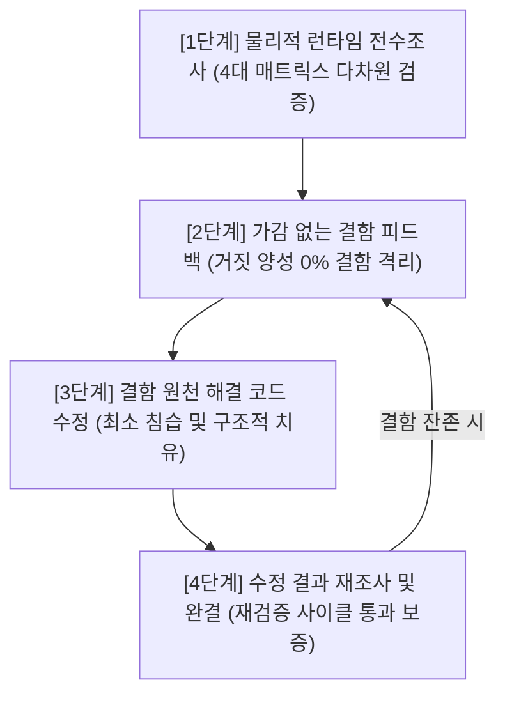

# 🔄 Exhaustive Audit & Self-Healing Verification Cycle Skill (전수조사-피드백-코드수정-재조사 폐루프 검증 스킬)

## 1. 개요 및 목적
단순 정적 텍스트 검색(`grep`, `includes`)에만 의존하여 "코드가 적혀 있으니 100% 정상 작동한다"고 단정하는 **성급한 허위 보고(False-Positive Report)를 원천 차단**하고, 실제 런타임 이벤트 전파, 레이어 스택 간섭, CSS 트랜스폼 컨텍스트, 기획 명세 일치도를 과학적으로 전수 검증하는 표준 엔지니어링 사이클입니다.

---

## 2. 4단계 폐루프 사이클 (The 4-Stage Closed-Loop Protocol)

모든 "전수조사" 요청 시 반드시 아래 4단계를 중단 없이 완결해야 합니다:

---

### [1단계] 물리적 런타임 전수조사 (Physical Runtime Audit)
정적 파일에 문자열이 존재하는지만 보는 행위를 엄격히 금지하며, 반드시 아래 **4대 검증 매트릭스**를 전수 대조합니다:

1. **이벤트 전달망 무결성 (Event Propagation Matrix)**:
   - 포인터 캡처(`setPointerCapture`), `stopPropagation()`이 자식/부모의 마우스 이벤트(`click`, `dblclick`, `pointerup`)를 가로채 증발시키는지 검증.
   - 드래그 기즈모(`TransformGizmo`)와 자식 컴포넌트 간 이벤트 핸들러 계약 및 더블클릭 감지 안전망(Click-time fallback) 구비 여부.
2. **시각 계층 및 레이어 스택 무결성 (Layer & Stack Matrix)**:
   - 각 템플릿 모드(Classic, Ssul, Instagram, Gunlimbo)별 레이어 격리 여부. 타 모드의 레터박스(상/하단 바), 대제목, 자막이 누수(Leakage)되어 겹치지 않는지 확인.
   - 유효하지 않은 CSS 클래스(예: `z-35` 등 브라우저 무효 클래스)로 인해 레이어가 바닥(`z-index: auto`)으로 묻히지 않는지 확인.
3. **렌더링 컨텍스트 및 좌표계 무결성 (Context & Scaling Matrix)**:
   - 플로팅 창/모달/인스펙터가 `scale(0.5~0.6)`이 걸린 캔버스 내부에 갇혀 축소 왜곡되거나 `overflow-hidden` 컨테이너에 의해 잘리지 않는지 확인.
   - 뷰포트 절대 좌표계 또는 스케일 영향 없는 독립 오버레이 레이어 렌더링 여부 확인.
4. **기획 명세 1:1 실측 동일성 (Spec Identity Matrix)**:
   - 목표 레퍼런스(Pixeling 등)의 규격과 실제 DOM 구조, 여백, 위계, 독립 컨트롤러가 1:1로 일치하는지 실제 화면 관점에서 대조.

---

### [2단계] 가감 없는 결함 피드백 보고 (Transparent Feedback Report)
- 발견된 결함을 축소하거나 은폐하지 않고, 실제 물리적 증거(코드 라인, 런타임 증상, 캡처된 이벤트 차단 지점)를 기반으로 솔직하고 명확하게 문서화.
- "무엇이 안 되는지", "왜 안 되는지(기술적 원인)", "어떤 규칙을 위반했는지"를 투명하게 공개.

---

### [3단계] 결함 원천 해결 코드 수정 (Root-Cause Remediation)
- 증상만 덮는 땜질식 패치가 아닌, 아키텍처적 원인(이벤트 캡처 해제, 템플릿 레이어 조건부 격리, 플로팅 렌더링 컨텍스트 분리)을 근본적으로 해결하는 프로덕션 레벨 코드 작성.
- Zero Omission & Token-Trimming Law 준수: 모듈 생략, TODO 주석, 임의 기능 축소 전면 금지.

---

### [4단계] 수정 결과 재조사 및 완결 (Re-Audit & Closure)
- 수정한 후 즉시 종료하지 않고, [1단계]의 4대 검증 매트릭스를 다시 실행하여 결함이 실제로 100% 해소되었는지 검증.
- `npm run build`, `node scripts/contract-checker.js`, `node scripts/storage-validator.js` 100% PASS 확인.
- 재조사 결과 및 경험을 바탕으로 본 스킬과 시스템 규칙을 한 단계 더 진화(Self-Evolution)시킴.
