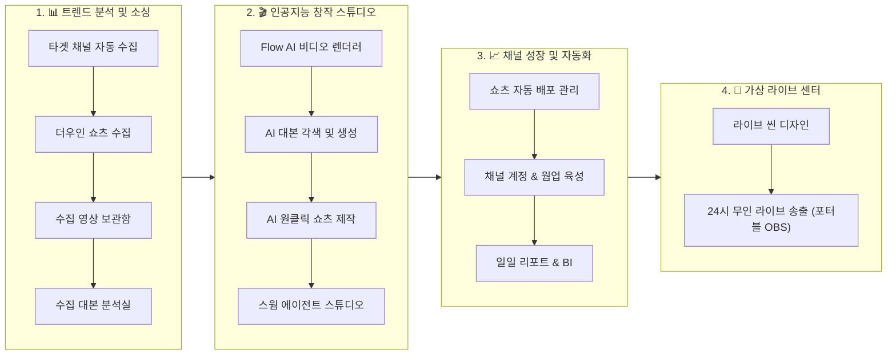

# ViraLoop Studio (VLStudio Desktop)

<kbd>[🇺🇸 English](README.md)</kbd> <kbd>🇰🇷 한국어</kbd>

> **"소싱부터 AI 대량 제작, 다채널 자동 배포, 24시간 무인 라이브 송출까지"**  
> AI 숏폼 크리에이터와 MCN 기업을 위한 **올인원 엔터프라이즈 콘텐츠 자동화 OS**

[](https://github.com/jmyoon312/VLStudio/releases)
[](LICENSE)
[](https://microsoft.com/windows)
[](#)

---

## 🚀 30초 원클릭 무인 자동 설치 가이드

사전 설치 프로그램(Git, Node.js, Python, FFmpeg 등)이 전혀 없는 초기화된 PC에서도 **명령어 단 1줄**로 완벽하게 구축됩니다.

### 방법 1. PowerShell 명령어 1줄 실행 (가장 빠름 ⚡)
**시작 버튼 우클릭 → [터미널] 또는 [PowerShell]**을 열고 아래 명령어를 붙여넣고 엔터를 누르면 끝납니다:
```powershell
irm https://raw.githubusercontent.com/jmyoon312/VLStudio/main/install.ps1 | iex
```

### 방법 2. 원클릭 인스톨러 배치 파일 다운로드 💾
1. 저장소에서 [`OneClick_Install.bat`](https://raw.githubusercontent.com/jmyoon312/VLStudio/main/OneClick_Install.bat) 다운로드
2. `OneClick_Install.bat` 더블클릭 (관리자 권한 실행)

> 💡 **자동으로 구성되는 환경**:
> - Git 소스 최신 동기화, Node.js LTS & Python 3.11 무인 설치
> - FFmpeg 6.0+, yt-dlp 바이너리, Android ADB 환경 자동 빌드
> - 포트 충돌 자동 해결, 방화벽 등록 및 바탕화면 **"ViraLoop Studio" 바로가기** 자동 생성

---

## 💎 ViraLoop Studio 4대 핵심 파이프라인

ViraLoop Studio는 단순한 영상 편집기가 아닙니다. **트렌드 소싱 ➔ AI 대량 제작 ➔ 채널 육성 및 자동 배포 ➔ 24시간 라이브 송출**까지 모든 과정을 단 하나의 데스크톱 앱에서 연결합니다.



---

### 1. 📊 트렌드 분석 및 소싱 (Sourcing Pipeline)
알고리즘 떡상 영상을 실시간으로 추적하고 바이럴 요소를 정밀 추출합니다.

* **타겟 채널 자동 수집 (`/channels`)**: 벤치마킹할 글로벌 유튜브/틱톡 채널을 24시간 자동 감시하여 신규 인기 영상을 즉시 수집.
* **더우인 쇼츠 수집 (`/douyin-search`)**: AI 시드 키워드 자동 확장으로 수백 개의 중국 인기 숏폼을 일괄 스크래핑 및 자막 자동 매핑.
* **URL 영상 직접 수집 (`/download`)**: 유튜브, 인스타 릴스, 틱톡 등 15개 이상 플랫폼 링크에서 최고 화질 무손실 다운로드.
* **수집 영상 보관함 (`/gallery`)**: 바이럴 지수(Velocity Score)와 등급(S/A/B)별 정렬, 떡상 성장 곡선 그래프 실시간 제공.
* **수집 대본 분석실 (`/script-lab`)**: Whisper AI 음성 자막 추출, 3초 후킹/본문/CTA 구간 분할 및 핵심 키워드 AI 분석.

---

### 2. 🎬 인공지능 창작 스튜디오 (Creation Pipeline)
수집된 데이터와 AI 엔진을 결합하여 고품질 숏폼 콘텐츠를 대량 렌더링합니다.

* **Flow AI 비디오 렌더러 (`/flow2capcut`)**: Google Flow AI(Veo 3.1) 모델로 100장 이상의 이미지/비디오를 배치 생성하고, 타임라인/Ken Burns 효과가 포함된 **CapCut 프로젝트로 원클릭 직접 출력**.
* **AI 대본 각색 및 생성 (`/script-writer`)**: 다중 LLM(Claude, Gemini, Groq, Llama)을 활용하여 원본 대본을 쇼츠 전용 후킹 대본으로 자동 리라이팅.
* **AI 원클릭 쇼츠 제작 (`/ddalkkak`)**: 자막 자동 생성, 대본+더빙(TTS) 합성, 클립 다중 편집을 **원클릭 10초 만에 일괄 렌더링**.
* **스웜 에이전트 스튜디오 (`/agent-studio`)**: 기획자, 작가, 비주얼 디렉터로 구성된 자율 AI 에이전트 네트워크가 협업하여 숏폼 에피소드 완벽 기획.
* **스마트 씬 분할 컷터 (`/scene-cutter-pro`)**: 롱폼 영상을 바이럴 씬 단위로 초고속 타임라인 분할.
* **AI 다국어 목소리 합성 (`/multi-tts`)**: ElevenLabs, Supertone, Edge-TTS 등 다국어 고음질 AI 보이스 생성.
* **무음 구간 자동 컷팅 (`/silence-remover`)**: 50ms 단위로 오디오 무음과 호흡을 초정밀 자동 컷팅하여 오디오 밀도 극대화.
* **AI 배경 및 개체 제거 (`/remover`)**: 불필요한 워터마크, 로고, 개체를 AI 인페인팅으로 깔끔하게 제거.

---

### 3. 📈 채널 성장 및 자동화 (Operation & Growth)
계정 정지 위험 없는 스텔스 멀티 채널 운영 및 자동 배포 인프라를 제공합니다.

* **쇼츠 자동 배포 관리 (`/work-queue`)**: 픽셀링(Pixeling) 메타 데이터 파싱 기반으로 YouTube Shorts, TikTok, Instagram Reels에 예약/즉시 자동 업로드.
* **채널 계정 & 웜업 육성 (`/incubator`)**: 
  * 계정별 독립 브라우저 프로필 및 듀얼 프록시(LTE/Clean IP) 격리로 **다계정 연좌제 밴 원천 차단**.
  * 7단계 인간 행동 모사(Human-like Viewing, 탐색, 댓글)로 신규 계정 신뢰도 극대화.
* **일일 리포트 & BI 인텔리전스 (`/reports`)**: 소싱 ➔ 제작 ➔ 배포 ➔ 채널 성장 전 주기를 한눈에 관제하는 통합 BI 대시보드.

---

### 4. 📡 가상 라이브 센터 (24/7 Virtual Live Streaming)
PC만 켜두면 365일 무중단으로 방송되는 유튜브/틱톡 무인 라이브 시스템입니다.

* **라이브 씬 디자인 (`/live-studio`)**: Lofi 배경 영상 루프, 실시간 시계, 공지 배너, AI 자막 등 멀티 레이어 라이브 화면을 Canva/OBS 스타일로 디자인.
* **24시 무인 라이브 송출 (`/station-manager`)**:
  * **채널별 포터블 OBS 격리 아키텍처**(`C:\ViraLoopMedia\OBS Program\OBS_Channel_...`) 구동.
  * **OBS-WebSocket v5 원격 제어**: ViraLoop 대시보드에서 원클릭 방송 시작/중지 및 실시간 FPS/비트레이트/CPU 모니터링.
  * **무중단 자가 치유 (Auto-Healing Watchdog)**: 네트워크 순간 끊김 및 프로세스 에러 시 5초 이내 자동 재시작 및 송출 복구.

---

## 🛠️ 기술 스택 (Tech Stack)

| 영역 | 사용 기술 |
| :--- | :--- |
| **Frontend UI** | React 18, Vite 6, Tailwind CSS, Radix UI, Lucide Icons, Recharts |
| **Desktop Shell** | Electron 36, Node.js LTS, IPC Bridge |
| **Backend Core** | Python 3.11, FastAPI, Celery, SQLite (Zero-Config Self-Healing) |
| **AI & Video Engines** | Google Flow AI (Veo 3.1), Whisper AI, FFmpeg 6.0+, PyTorch, OpenCV |
| **Automation & Stealth** | Patchright, CloakBrowser Profiles, LTE Dual Proxy Router, OBS-WebSocket v5 |
| **Protocols & LLM** | Model Context Protocol (MCP), Anthropic Claude, Google Gemini, Groq |

---

## 📖 라이선스 (License)

본 프로젝트는 [AGPL-3.0 License](LICENSE)를 따릅니다.
