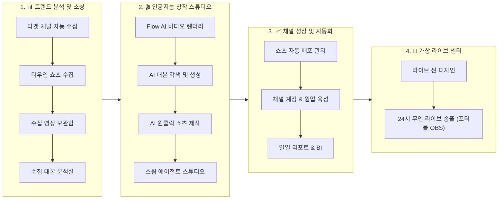

# ViraLoop Studio (VLStudio Desktop)

<kbd>[🇺🇸 English](README.md)</kbd> <kbd>🇰🇷 한국어</kbd>

> **"트렌드 소싱부터 AI 대량 제작, 다채널 무인 배포, 24시간 무인 라이브 송출까지"**  
> AI 숏폼 크리에이터, 미디어 네트워크 및 MCN 기업을 위한 **올인원 엔터프라이즈 콘텐츠 자동화 OS**

[](https://github.com/jmyoon312/VLStudio/releases)
[](LICENSE)
[](https://microsoft.com/windows)
[](#)

---

## 🚀 30초 원클릭 무인 자동 설치 가이드

사전 설치 프로그램(Git, Node.js, Python, FFmpeg 등)이 전혀 없는 초기화된 윈도우 PC에서도 **명령어 단 1줄**로 완벽하게 구축됩니다.

### 방법 1. PowerShell 명령어 1줄 실행 (가장 빠름 ⚡)
**시작 버튼 우클릭 → [터미널] 또는 [PowerShell]**을 열고 아래 명령어를 붙여넣은 뒤 엔터를 누르면 끝납니다:
```powershell
irm https://raw.githubusercontent.com/jmyoon312/VLStudio/main/install.ps1 | iex
```

### 방법 2. 원클릭 인스톨러 배치 파일 다운로드 💾
1. 저장소에서 [`OneClick_Install.bat`](https://raw.githubusercontent.com/jmyoon312/VLStudio/main/OneClick_Install.bat) 다운로드
2. `OneClick_Install.bat` 더블클릭 (관리자 권한 실행)

> 💡 **자동으로 구성되는 환경**:
> - Git 소스 최신 동기화, Node.js LTS & Python 3.11 무인 설치
> - FFmpeg 6.0+, yt-dlp 바이너리, Android ADB 환경 자동 빌드
> - 포트 충돌 자동 해결, 방화벽 등록 및 바탕화면 **"ViraLoop Studio" 바로가기** 자동 생성

---

## 📱 원격 워크스테이션 & 스마트폰 모바일 워크플로우

ViraLoop Studio는 호스트 메인 PC뿐만 아니라, **스마트폰(모바일 브라우저)이나 외부 노트북 크롬에서도 메인 PC의 고성능 엔진을 원격 제어**할 수 있는 원격 워크스테이션 아키텍처를 지원합니다.

```
[📱 스마트폰 / 외부 노트북 (원격 웹)]
  │
  │ • 이동 중 픽셀링 메타 등록, 대본 각색, AI 미디어 생성 지시
  │ • [CapCut 내보내기] 클릭 ➔ 메인 서버 PC로 프로젝트 데이터 전송
  ▼
[🖥️ 메인 워크스테이션 (서버 PC)]
  │
  │ • 서버 PC C드라이브 CapCut 프로젝트 폴더에 무압축 즉시 조립 생성!
  │ • (옵션) 백그라운드에서 CapCut 데스크톱 앱 자동 실행
  ▼
[🏠 집/사무실 복귀 시]
  • 메인 PC CapCut 첫 화면에 스마트폰에서 작업한 프로젝트가 완성된 상태로 즉시 대기!
```

* **로컬 웹 대시보드**: `http://localhost:5183`
* **사내/홈 LAN 접속**: `http://192.168.x.x:5183` (스마트폰에서 대용량 영상 즉시 업로드 & 원격 제어)
* **Nginx Proxy Manager / 도메인 연동**: 공인 도메인(예: `https://viraloop.yourdomain.com`)을 통한 외부 원격 관제 지원

---

## 🌐 하이브리드 네트워크 프록시 인프라 (LTE 동적 + ISP 전용 고정 IP)

ViraLoop Studio는 유튜브/틱톡의 다계정 연좌제 밴을 완벽히 차단하기 위해 **2가지 네트워크 격리 전략**을 동시에 지원합니다:

```
┌─────────────────────────────────────────────────────────────────────────┐
│                    ViraLoop 하이브리드 IP 인프라 전략                    │
├───────────────────────────────────┬─────────────────────────────────────┤
│ 📱 [1] 모바일 LTE/5G 동적 Clean IP │ 🏢 [2] 채널별 1:1 ISP 전용 고정 IP  │
├───────────────────────────────────┼─────────────────────────────────────┤
│ • 신규 계정 대량 생성 및 7단계 웜업│ • 성장한 메인 브랜드 채널 장기 운영  │
│ • 비행기 모드 자동 토글로 IP 리셋 │ • 채널당 고유 통신사 고정 IP 영구 매핑│
│ • 연좌제 밴 방지 및 탐색 활동     │ • 로그인 지역/IP 변경 없는 최고 신뢰도│
└───────────────────────────────────┴─────────────────────────────────────┘
```

### 📱 1. 스마트폰 LTE Clean IP 하드웨어 테더링
고가의 유료 프록시 없이 안드로이드 스마트폰(공기계)의 통신사 4G/5G Clean IP를 PC로 공급합니다.
1. **스마트폰 USB 디버깅 ON**: [설정] ➔ [휴대전화 정보] ➔ [소프트웨어 정보] ➔ [빌드 번호 7번 탭] ➔ [개발자 옵션] ➔ [USB 디버깅] 활성화.
2. **Every Proxy 앱**: Google Play 설치 후 **`SOCKS5` 활성화 (기본 포트: `10808`)**.
3. **PC USB 연결**: ViraLoop Studio의 `채널 계정 & 웜업 육성 (/incubator)`에서 자동 인식 및 **비행기 모드 토글로 IP 자동 회전**.

### 🏢 2. 채널별 1:1 ISP 전용 고정 IP (Dedicated Residential Proxy)
* 채널 프로필별로 `HTTP / HTTPS / SOCKS5` 프로토콜 기반의 **`ip:port:user:pass`**를 1:1 영구 바인딩.
* 브라우저 실행 시 해당 채널에 할당된 ISP 고정 IP로만 통신하도록 네트워크를 완벽 격리하여 최고 수준의 채널 신뢰도를 유지.

---

## 🛡️ 보안 브라우징 듀얼 엔진 (CloakBrowser & ixBrowser)

### 1. CloakBrowser (내장형 경량 스텔스 엔진)
* 별도 프로그램 설치 없이 기본 내장된 자체 개발 스텔스 엔진.
* Patchright 기반 WebGL/Canvas/AudioContext 노이즈 주입, `navigator.webdriver = false`, 하드웨어 핑거프린트 분리, WebRTC 실제 IP 누출 원천 차단.

### 2. ixBrowser (엔터프라이즈 멀티 계정 안티디텍트 브라우저)
* 수십~수백 개의 구글/유튜브 브랜드 채널을 기업 단위로 운영할 때 사용하는 전문 안티디텍트 브라우저.
* [ixBrowser 공식 홈페이지](https://www.ixbrowser.com/) 클라이언트 설치 후 **Local API(기본 포트: `53200`)** 활성화 연동.

---

## 💎 ViraLoop Studio 4대 엔드-투-엔드 파이프라인



---

### 1. 📊 트렌드 분석 및 소싱 (Sourcing Pipeline)
* **타겟 채널 자동 수집 (`/channels`)**: 벤치마킹할 글로벌 유튜브/틱톡 채널을 24시간 자동 감시하여 신규 인기 영상을 즉시 수집.
* **더우인 쇼츠 수집 (`/douyin-search`)**: AI 시드 키워드 자동 확장으로 수백 개의 중국 인기 숏폼을 일괄 스크래핑 및 자막 자동 매핑.
* **URL 영상 직접 수집 (`/download`)**: 유튜브, 인스타 릴스, 틱톡 등 15개 이상 플랫폼 링크에서 최고 화질 무손실 다운로드.
* **수집 영상 보관함 (`/gallery`)**: 바이럴 지수(Velocity Score)와 등급(S/A/B)별 정렬, 떡상 성장 곡선 그래프 실시간 제공.
* **수집 대본 분석실 (`/script-lab`)**: Whisper AI 음성 자막 추출, 3초 후킹/본문/CTA 구간 분할 및 핵심 키워드 AI 분석.

---

### 2. 🎬 인공지능 창작 스튜디오 (Creation Pipeline)
* **Flow AI 비디오 렌더러 (`/flow2capcut`)**:
  * Google Flow AI(Veo 3.1) 모델 기반 **100장 이상의 고화질 AI 이미지/비디오 배치 대량 생성**.
  * 캐릭터/스타일 87개 프리셋 자동 주입으로 씬 간 일관성 유지.
  * **CapCut 데스크톱 프로젝트 다이렉트 파일시스템 조립 (No-ZIP)**: ZIP 다운로드 없이 로컬 CapCut 설치 경로의 프로젝트 파일(`draft_content.json`)에 비디오, 멀티트랙 오디오, 자막(SRT), Ken Burns 줌 효과를 100% 직접 조립하여 CapCut 자동 실행.
  * **스마트폰/외부 브라우저 원격 내보내기 지원**: 모바일 웹에서도 터치 한 번으로 서버 컴퓨터의 CapCut 프로젝트로 즉시 전송 및 생성.
* **AI 대본 각색 및 생성 (`/script-writer`)**: 다중 LLM(Claude, Gemini, Groq, Llama)을 활용하여 원본 대본을 쇼츠 전용 후킹 대본으로 자동 리라이팅.
* **AI 원클릭 쇼츠 제작 (`/ddalkkak`)**: 자막 자동 생성, 대본+더빙(TTS) 합성, 클립 다중 편집을 **원클릭 10초 만에 일괄 렌더링**.
* **스마트 씬 분할 컷터 (`/scene-cutter-pro`)**: 롱폼 영상을 바이럴 씬 단위로 초고속 타임라인 분할.
* **AI 다국어 목소리 합성 (`/multi-tts`)**: ElevenLabs, Supertone, Edge-TTS 등 다국어 고음질 AI 보이스 생성.
* **무음 구간 자동 컷팅 (`/silence-remover`)**: 50ms 단위로 오디오 무음과 호흡을 초정밀 자동 컷팅하여 오디오 밀도 극대화.
* **AI 배경 및 개체 제거 (`/remover`)**: 불필요한 워터마크, 로고, 개체를 AI 인페인팅으로 깔끔하게 제거.

---

### 3. 📈 채널 성장 및 자동화 (Operation & Growth)
* **쇼츠 자동 배포 관리 (`/work-queue`)**: 
  * **픽셀링(Pixeling) 메타 자동 파싱**: 픽셀링 분석 텍스트를 붙여넣기만 하면 제목, 해시태그, 설명, 보이스 설정이 0.1초 만에 자동 구조화.
  * **표준 네이밍 룰 1:1 연동**: 픽셀링 메타 제목이 CapCut 프로젝트명 및 폴더명으로 일치되어 대량 일괄 작업 시 혼선 완전 차단.
  * YouTube Shorts, TikTok, Instagram Reels에 예약/즉시 자동 업로드.
* **채널 계정 & 웜업 육성 (`/incubator`)**: 
  * LTE 동적 IP 및 1:1 ISP 고정 IP 하이브리드 바인딩.
  * 7단계 인간 행동 모사(Human-like Viewing, 탐색, 댓글)로 신규 계정 신뢰도 극대화.
* **일일 리포트 & BI 인텔리전스 (`/reports`)**: 소싱 ➔ 제작 ➔ 배포 ➔ 채널 성장 전 주기를 한눈에 관제하는 통합 BI 대시보드.

---

### 4. 📡 가상 라이브 센터 (24/7 Virtual Live Streaming)
* **라이브 씬 디자인 (`/live-studio`)**: Lofi 배경 영상 루프, 실시간 시계, 공지 배너, AI 자막 등 멀티 레이어 라이브 화면을 Canva/OBS 스타일로 디자인.
* **24시 무인 라이브 송출 (`/station-manager`)**:
  * **채널별 포터블 OBS 격리 아키텍처**(`C:\ViraLoopMedia\OBS Program\OBS_Channel_...`) 구동.
  * **OBS-WebSocket v5 원격 제어**: ViraLoop 대시보드에서 원클릭 방송 시작/중지 및 실시간 FPS/비트레이트/CPU 모니터링.
  * **무중단 자가 치유 (Auto-Healing Watchdog)**: 네트워크 순간 끊김 및 프로세스 에러 시 5초 이내 자동 재시작 및 송출 복구.

---

## ⚡ 엔터프라이즈 특화 핵심 기능 (Core Advantages)

1. **🔄 다중 AI API 키 자동 순환 (Round-Robin & Auto-Fallback)**:
   * Gemini, Claude, Groq, OpenAI 등 동일 모델의 API 키를 다중 등록 시 자동 순환하여 `429 Rate Limit` 에러를 원천 차단.
2. **🎬 CapCut 무압축 다이렉트 프로젝트 생성 (No-ZIP Workflow)**:
   * 압축 해제 없이 로컬 CapCut 작업 폴더에 직접 완성본 프로젝트를 기록하고 1초 만에 CapCut 자동 실행.
3. **📱 원격 CapCut 프로젝트 생성 브리지 (Remote Workstation)**:
   * 핸드폰이나 외부 노트북 브라우저에서도 메인 서버 PC의 CapCut 폴더로 프로젝트를 원격 생성 및 열기 지원.
4. **⚡ 픽셀링(Pixeling) 원클릭 대기열 메타 파싱**:
   * 영상 기획 메타 텍스트를 복사-붙여넣기하는 즉시 모든 배포 파라미터 및 CapCut 프로젝트 네이밍 자동 완성.
5. **🤖 내장 MCP (Model Context Protocol) 서버**:
   * Claude Code CLI에서 씬 생성, 프롬프트 일괄 수정, 레퍼런스 주입을 완벽 원격 제어.

---

## ⚙️ 필수 도구 수동 설치 & 폴더 배치 매뉴얼 (네트워크 차단/수동 구성 시)

| 도구 | 필수 용도 | 공식 다운로드 링크 | 📂 수동 배치 경로 |
| :--- | :--- | :--- | :--- |
| **Node.js LTS** | 대시보드 및 Electron 구동 | [nodejs.org](https://nodejs.org) (v20.x MSI) | 기본 경로에 설치 |
| **Python 3.11** | AI 백엔드 및 미디어 처리 코어 | [python.org](https://www.python.org/downloads/) (3.11.x) | *Add Python to PATH* 체크 후 설치 |
| **Android ADB** | 모바일 프록시 & 자동 웜업 제어 | [Google Platform-Tools](https://dl.google.com/android/repository/platform-tools-latest-windows.zip) | `VLStudio\runtime\adb\adb.exe` |
| **yt-dlp** | 15개 플랫폼 영상 고속 다운로드 | [yt-dlp Releases](https://github.com/yt-dlp/yt-dlp/releases) | `VLStudio\runtime\ytdlp\yt-dlp.exe` |
| **FFmpeg 6.0+** | 영상 씬 분할, 인코딩, 오디오 믹싱 | [gyan.dev FFmpeg](https://www.gyan.dev/ffmpeg/builds/) | `C:\ffmpeg\bin` (또는 PATH 등록) |

---

## 🏗️ 시스템 아키텍처 & 프로젝트 구조

```
VLStudio/
├── electron/                    # Electron 메인 프로세스
│   ├── main.js                 # 윈도우/컨텍스트 라이프사이클 관리
│   ├── preload.js              # Context Bridge (window.electronAPI)
│   └── ipc/                    # 네이티브 IPC 핸들러 (fs, flow, dom, video, capcut, auth)
│
├── apps/                        # 모노레포 워크스페이스
│   ├── dashboard/              # React 18 + Vite 6 대시보드 프론트엔드
│   ├── api/                    # Python FastAPI 백엔드 (SQLite DB, Fernet 보안 암호화)
│   └── swarm/                  # 자율 AI 스웜 에이전트 코어
│
├── runtime/                     # 포터블 바이너리 런타임 폴더
│   ├── adb/                    # Android Platform Tools (adb.exe)
│   └── ytdlp/                  # yt-dlp 바이너리 (yt-dlp.exe)
│
├── docs/                       # 기술 명세서, 데이터 스키마 및 아키텍처 문서
├── install.ps1                 # 무인 자동 설치 파워쉘 스크립트
├── OneClick_Install.bat        # 원클릭 윈도우 인스톨러
└── package.json
```

---

## 🛠️ 개발자 가이드 (Developer Guide)

```bash
# 저장소 클론
git clone https://github.com/jmyoon312/VLStudio.git
cd VLStudio

# 의존성 설치
npm install

# 개발 모드 실행
npm run dev

# 프로덕션 빌드 (Windows NSIS / AppX)
npm run dist:win
```

---

## 📖 라이선스 및 고지사항 (License & Disclaimer)

본 프로젝트는 **[GNU Affero General Public License v3 (AGPL-3.0)](LICENSE)** 라이선스를 따릅니다.  
*ViraLoop Studio는 ViraLoopMedia에서 개발한 독립 소프트웨어이며, Google 또는 ByteDance(CapCut)와 공식적으로 제휴되거나 보증되지 않습니다.*
