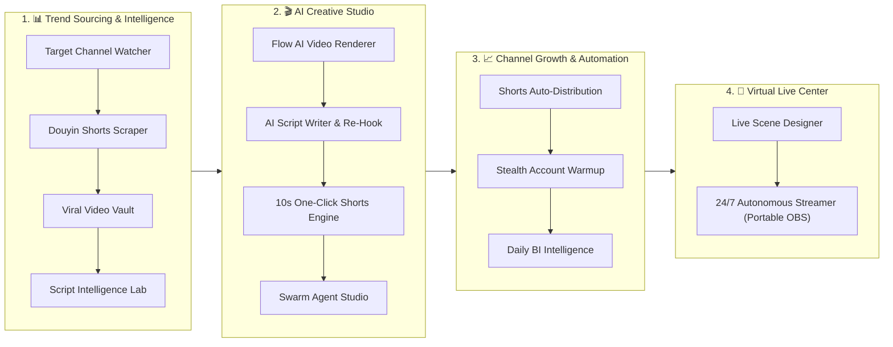

# ViraLoop Studio (VLStudio Desktop)

<kbd>🇺🇸 English</kbd> <kbd>[🇰🇷 한국어](README.ko.md)</kbd>

> **"From Viral Trend Sourcing and AI Mass Generation to Multi-Channel Distribution and 24/7 Virtual Live Streaming."**  
> The premier **All-in-One Enterprise Content Automation OS** built for AI short-form creators, media networks, and automated video empires.

[](https://github.com/jmyoon312/VLStudio/releases)
[](LICENSE)
[](https://microsoft.com/windows)
[](#)

---

## 🚀 30-Second Zero-Config Automated Installation

No prior setup required. Even on a freshly installed Windows machine without Git, Node.js, Python, or FFmpeg, you can deploy ViraLoop Studio with **a single terminal command**.

### Option 1. One-Line PowerShell Command (Fastest ⚡)
**Right-click Start Button → Open [Terminal] or [PowerShell]**, paste the following command, and press Enter:
```powershell
irm https://raw.githubusercontent.com/jmyoon312/VLStudio/main/install.ps1 | iex
```

### Option 2. One-Click Batch Installer 💾
1. Download [`OneClick_Install.bat`](https://raw.githubusercontent.com/jmyoon312/VLStudio/main/OneClick_Install.bat) from this repository.
2. Double-click `OneClick_Install.bat` (Run as Administrator).

> 💡 **What is automatically provisioned**:
> - Git source synchronization & zero-downtime updates
> - Node.js LTS & Python 3.11 silent installation
> - Pre-bundled FFmpeg 6.0+, yt-dlp binaries, and Android ADB tooling
> - Port conflict auto-resolution, Windows Firewall rules, and desktop shortcut generation.

---

## ⚙️ Manual Tool Setup & Binary Placement Guide

If corporate firewalls or air-gapped networks block automated downloads, download the required binaries from official sources and place them into the following directories:

| Tool | Purpose | Official Download Link | 📂 Manual Target Path |
| :--- | :--- | :--- | :--- |
| **Node.js LTS** | Dashboard & Electron Runtime | [nodejs.org](https://nodejs.org) (v20.x MSI) | Standard installation |
| **Python 3.11** | Backend AI & Processing Core | [python.org](https://www.python.org/downloads/) (3.11.x) | Check *Add Python to PATH* |
| **Android ADB** | Mobile Proxy & Warmup Controller | [Google Platform-Tools](https://dl.google.com/android/repository/platform-tools-latest-windows.zip) | `VLStudio\runtime\adb\adb.exe` |
| **yt-dlp** | 15+ Platform Video Downloader | [yt-dlp Releases](https://github.com/yt-dlp/yt-dlp/releases) | `VLStudio\runtime\ytdlp\yt-dlp.exe` |
| **FFmpeg 6.0+** | Video Splitting & Audio Mixing | [gyan.dev FFmpeg](https://www.gyan.dev/ffmpeg/builds/) | `C:\ffmpeg\bin` (or System PATH) |

---

## 🌐 Hybrid Proxy Infrastructure (Mobile LTE Dynamic + Dedicated ISP Static IP)

To eliminate platform correlation bans and shadowbans, ViraLoop Studio provides a **dual network isolation strategy**:

```
┌─────────────────────────────────────────────────────────────────────────┐
│                    ViraLoop Hybrid IP Architecture                      │
├───────────────────────────────────┬─────────────────────────────────────┤
│ 📱 [1] Mobile LTE/5G Dynamic IP    │ 🏢 [2] 1:1 Dedicated ISP Static IP  │
├───────────────────────────────────┼─────────────────────────────────────┤
│ • Mass account creation & warmup  │ • Long-term main brand channel ops  │
│ • Automated Airplane Mode resets  │ • 1:1 Permanent residential binding │
│ • Prevents cross-account bans     │ • Zero geo-hops for maximum trust   │
└───────────────────────────────────┴─────────────────────────────────────┘
```

### 📱 1. Mobile LTE Clean IP Hardware Tethering
Connect real Android smartphones to route genuine carrier 4G/5G Clean IPs directly to your desktop without paying proxy subscriptions:
1. **Enable USB Debugging**: [Settings] ➔ [About phone] ➔ [Software info] ➔ Tap [Build number] 7 times ➔ [Developer options] ➔ Enable [USB Debugging].
2. **Every Proxy App**: Install from Play Store and **turn ON `SOCKS5` (Port: `10808`)**.
3. **USB Connection**: ViraLoop Studio's `Incubator (/incubator)` auto-detects the device and provides **automated Airplane Mode IP rotation**.

### 🏢 2. 1:1 Dedicated ISP Static Proxies (Residential)
* Bind permanent `HTTP / HTTPS / SOCKS5` credentials (`ip:port:user:pass`) directly to individual channel profiles.
* Isolates channel traffic strictly to its designated residential ISP address, preserving highest platform authority.

---

## 🛡️ Dual Anti-Detect Stealth Engines (CloakBrowser & ixBrowser)

### 1. CloakBrowser (Built-in Lightweight Stealth Engine)
* Zero external software required; native Python Patchright + Chromium WebContentsView.
* WebGL, Canvas, and AudioContext noise masking, `navigator.webdriver = false`, hardware fingerprint isolation, WebRTC local IP leak protection.

### 2. ixBrowser (Enterprise Multi-Account Anti-Detect Engine)
* Built for enterprise media networks managing dozens to hundreds of brand channels.
* Install [ixBrowser Client](https://www.ixbrowser.com/), enable **Local API (Port: `53200`)**, and select ixBrowser mode in ViraLoop Studio settings.

---

## 💎 The 4 Core End-to-End Pipelines



---

### 1. 📊 Trend Sourcing & Intelligence Pipeline
* **Target Channel Auto-Collection (`/channels`)**: 24/7 automated monitoring of global benchmark YouTube/TikTok channels with instant media/script ingestion.
* **Douyin Shorts Scraper (`/douyin-search`)**: Automated seed keyword expansion scraping hundreds of trending Chinese short-form videos with instant subtitle mapping.
* **Direct URL Downloader (`/download`)**: Lossless high-speed batch downloads from 15+ video platforms (YouTube, Reels, TikTok, Douyin, Kuaishou).
* **Viral Video Vault (`/gallery`)**: Velocity/EV Score ranking, S/A/B classification, and interactive viral growth curve analytics.
* **Script Intelligence Lab (`/script-lab`)**: Whisper AI speech-to-text extraction, 3-second hook decomposition, and AI sentiment analysis.

---

### 2. 🎬 AI Creative Studio Pipeline
* **Flow AI Video Renderer (`/flow2capcut`)**:
  * Mass-generate 100+ AI images/videos via Google Flow AI (Veo 3.1) with 87 style/character presets.
  * **Direct Native CapCut Project Assembly (No-ZIP)**: Compiles multi-track audio, Ken Burns zoom animations, and SRT subtitles directly into local CapCut `draft_content.json` files and launches the desktop app in 1 second.
* **AI Script Writer & Re-Hook (`/script-writer`)**: Multi-LLM engine (Claude, Gemini, Groq, Llama) rewriting raw scripts into high-retention short-form scripts.
* **10s One-Click Shorts Engine (`/ddalkkak`)**: Instant subtitle transcription, AI voice dubbing, and clip trimming in under 10 seconds.
* **Swarm Agent Studio (`/agent-studio`)**: Autonomous multi-agent network (OpenClaude, OpenHands, Hermes Core) collaboratively generating full video episodes.
* **Smart Scene Cutter (`/scene-cutter-pro`)**: Rapid timeline-based scene partitioning for long-form video repurposing.
* **AI Multilingual Voice Synth (`/multi-tts`)**: ElevenLabs, Supertone, and Edge-TTS voice cloning and multilingual narration.
* **Smart Silence Remover (`/silence-remover`)**: 50ms-precision breath and silence auto-trimming for maximum audio density.
* **AI Object & Watermark Remover (`/remover`)**: AI-powered inpainting to erase logos, watermarks, and unwanted elements.

---

### 3. 📈 Channel Growth & Stealth Automation
* **Shorts Auto-Distribution (`/work-queue`)**: 
  * **Pixeling Metadata Parser**: Paste structured analysis text to instantly populate title, tags, description, and voice parameters.
  * Scheduled/instant auto-publishing to YouTube Shorts, TikTok, and Instagram Reels.
* **Stealth Account Warmup & Incubator (`/incubator`)**: 
  * LTE dynamic & 1:1 ISP static hybrid proxy binding.
  * 7-stage humanized warmup activity (viewing, scrolling, commenting) boosting channel trust scores.
* **Daily BI Intelligence Reports (`/reports`)**: Unified enterprise reporting covering sourcing volumes, rendering queues, distribution velocity, and subscriber gains.

---

### 4. 📡 Virtual Live Center (24/7 Autonomous Live Streaming)
* **Live Scene Designer (`/live-studio`)**: Multi-layer canvas editor for Lofi video loops, widgets, real-time clocks, and AI ticker overlays.
* **24/7 Autonomous Live Streamer (`/station-manager`)**:
  * **Portable OBS Multi-Instance Isolation** (`C:\ViraLoopMedia\OBS Program\OBS_Channel_...`).
  * **OBS-WebSocket v5 Remote Orchestration**: One-click stream starts/stops, real-time FPS/bitrate/CPU telemetry.
  * **Auto-Healing Watchdog Engine**: Recovers crashed processes or lost connections within 5 seconds for 365-day uninterrupted uptime.

---

## ⚡ Enterprise Advantages

1. **🔄 Multi-LLM API Key Round-Robin**:
   * Auto-rotates multiple Gemini, Claude, Groq, and OpenAI keys to eliminate `429 Rate Limit` errors during batch generation.
2. **🎬 Zero-ZIP Native CapCut Assembly**:
   * No archive downloads required; writes directly to local CapCut project folders.
3. **⚡ Instant Pixeling Metadata Parsing**:
   * Converts raw video briefs into fully configured distribution queue items in 0.1 seconds.
4. **🤖 Model Context Protocol (MCP) Server**:
   * Full remote orchestration directly from Claude Code CLI.

---

## 🏗️ Technical Architecture & Project Structure

```
VLStudio/
├── electron/                    # Electron main process
│   ├── main.js                 # Window and WebContents lifecycle
│   ├── preload.js              # Secure context bridge (window.electronAPI)
│   └── ipc/                    # Native IPC handlers (fs, flow, dom, video, capcut, auth)
│
├── apps/                        # Monorepo Workspace Applications
│   ├── dashboard/              # React 18 + Vite 6 frontend dashboard
│   ├── api/                    # Python FastAPI local backend (SQLite DB, Fernet encryption)
│   └── swarm/                  # Autonomous swarm agent core
│
├── runtime/                     # Portable binary runtime directory
│   ├── adb/                    # Android Platform Tools (adb.exe)
│   └── ytdlp/                  # yt-dlp binary (yt-dlp.exe)
│
├── docs/                       # Technical specs, architecture guides, schemas
├── install.ps1                 # Automated PowerShell installer
├── OneClick_Install.bat        # Windows one-click installer
└── package.json
```

---

## 🛠️ Developer Guide

```bash
# Clone the repository
git clone https://github.com/jmyoon312/VLStudio.git
cd VLStudio

# Install dependencies
npm install

# Start development mode
npm run dev

# Build Windows distribution (NSIS / AppX)
npm run dist:win
```

---

## 📖 License & Disclaimer

This project is licensed under the **[GNU Affero General Public License v3 (AGPL-3.0)](LICENSE)**.  
*ViraLoop Studio is an independent product developed by ViraLoopMedia and is not affiliated with, endorsed by, or sponsored by Google or ByteDance (CapCut).*
