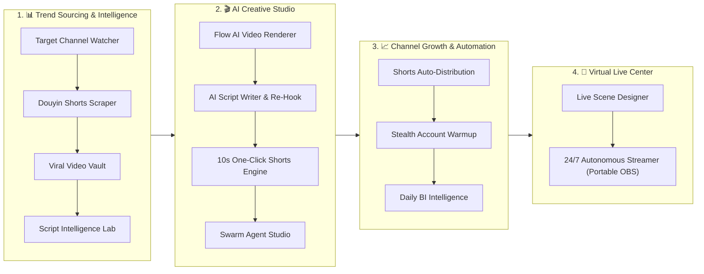

# ViraLoop Studio (VLStudio Desktop)

<kbd>🇺🇸 English</kbd> <kbd>[🇰🇷 한국어](README.ko.md)</kbd>

> **"From Viral Trend Sourcing and AI Mass Generation to Multi-Channel Distribution and 24/7 Virtual Live Streaming."**  
> The premier **All-in-One Enterprise Content Automation OS** built for AI short-form creators, media networks, and automated video empires.

[](https://github.com/jmyoon312/VLStudio/releases)
[](LICENSE)
[](https://microsoft.com/windows)
[](#)

---

## 🚀 30-Second Zero-Config Automated Installation

No prior setup required. Even on a freshly installed Windows machine without Git, Node.js, Python, or FFmpeg, you can deploy ViraLoop Studio with **a single terminal command**.

### Option 1. One-Line PowerShell Command (Fastest ⚡)
**Right-click Start Button → Open [Terminal] or [PowerShell]**, paste the following command, and press Enter:
```powershell
irm https://raw.githubusercontent.com/jmyoon312/VLStudio/main/install.ps1 | iex
```

### Option 2. One-Click Batch Installer 💾
1. Download [`OneClick_Install.bat`](https://raw.githubusercontent.com/jmyoon312/VLStudio/main/OneClick_Install.bat) from this repository.
2. Double-click `OneClick_Install.bat` (Run as Administrator).

> 💡 **What is automatically provisioned**:
> - Git source synchronization & zero-downtime updates
> - Node.js LTS & Python 3.11 silent installation
> - Pre-bundled FFmpeg 6.0+, yt-dlp binaries, and Android ADB tooling
> - Port conflict auto-resolution, Windows Firewall rules, and desktop shortcut generation.

---

## 🌐 Local Web & Mobile/LAN Remote Access

ViraLoop Studio is not limited to your desktop window. Access and control the entire workstation from smartphones, tablets, or external browsers across your local network.

* **Local Web Dashboard**: `http://localhost:5183`
* **LAN Access**: `http://192.168.x.x:5183` (Direct high-speed media upload from mobile phones)
* **Nginx Proxy Manager / Reverse Proxy**: Full support for custom domain routing (e.g. `https://viraloop.yourdomain.com`).

---

## 💎 The 4 Core End-to-End Pipelines

ViraLoop Studio seamlessly unifies **Trend Sourcing ➔ AI Batch Creation ➔ Multi-Channel Growth & Stealth Distribution ➔ 24/7 Virtual Live Streaming** into a single, high-performance desktop workstation.



---

### 1. 📊 Trend Sourcing & Intelligence Pipeline
Track viral anomalies in real-time and extract high-engagement blueprints.

* **Target Channel Auto-Collection (`/channels`)**: 24/7 automated monitoring of global benchmark YouTube/TikTok channels with instant media/script ingestion.
* **Douyin Shorts Scraper (`/douyin-search`)**: Automated seed keyword expansion scraping hundreds of trending Chinese short-form videos with instant subtitle mapping.
* **Direct URL Downloader (`/download`)**: Lossless high-speed batch downloads from 15+ video platforms (YouTube, Reels, TikTok, Douyin, Kuaishou).
* **Viral Video Vault (`/gallery`)**: Velocity/EV Score ranking, S/A/B classification, and interactive viral growth curve analytics.
* **Script Intelligence Lab (`/script-lab`)**: Whisper AI speech-to-text extraction, 3-second hook decomposition, and AI sentiment analysis.

---

### 2. 🎬 AI Creative Studio Pipeline
Transform raw ideas and viral blueprints into broadcast-quality short-form videos.

* **Flow AI Video Renderer (`/flow2capcut`)**:
  * Mass-generate 100+ AI images/videos via Google Flow AI (Veo 3.1).
  * Auto-inject 87 style/character reference presets to maintain visual consistency across 200+ scenes.
  * Direct one-click export into **ready-to-edit native CapCut project files** (with timeline, multi-track audio, Ken Burns animation, and SRT subtitles).
* **AI Script Writer & Re-Hook (`/script-writer`)**: Multi-LLM engine (Claude, Gemini, Groq, Llama) rewriting raw scripts into high-retention short-form scripts.
* **10s One-Click Shorts Engine (`/ddalkkak`)**: Instant subtitle transcription, AI voice dubbing, and clip trimming in under 10 seconds.
* **Swarm Agent Studio (`/agent-studio`)**: Autonomous multi-agent network (OpenClaude, OpenHands, Hermes Core) collaboratively generating full video episodes.
* **Smart Scene Cutter (`/scene-cutter-pro`)**: Rapid timeline-based scene partitioning for long-form video repurposing.
* **AI Multilingual Voice Synth (`/multi-tts`)**: ElevenLabs, Supertone, and Edge-TTS voice cloning and multilingual narration.
* **Smart Silence Remover (`/silence-remover`)**: 50ms-precision breath and silence auto-trimming for maximum audio density.
* **AI Object & Watermark Remover (`/remover`)**: AI-powered inpainting to erase logos, watermarks, and unwanted elements.

---

### 3. 📈 Channel Growth & Stealth Automation
Scale hundreds of channels without fear of shadowbans or chain suspensions.

* **Shorts Auto-Distribution (`/work-queue`)**: Pixeling metadata parser scheduling and publishing videos to YouTube Shorts, TikTok, and Instagram Reels.
* **Stealth Account Warmup & Incubator (`/incubator`)**: 
  * Isolated browser profiles paired with dual LTE clean proxies to **prevent multi-account correlation bans**.
  * 7-stage humanized warmup activity (viewing, scrolling, commenting) boosting channel trust scores.
* **Daily BI Intelligence Reports (`/reports`)**: Unified enterprise reporting covering sourcing volumes, rendering queues, distribution velocity, and subscriber gains.

---

### 4. 📡 Virtual Live Center (24/7 Autonomous Live Streaming)
Run non-stop 24/7 automated YouTube and TikTok live streams without keeping heavy desktop GUIs open.

* **Live Scene Designer (`/live-studio`)**: Multi-layer canvas editor for Lofi video loops, widgets, real-time clocks, and AI ticker overlays.
* **24/7 Autonomous Live Streamer (`/station-manager`)**:
  * **Portable OBS Multi-Instance Isolation** (`C:\ViraLoopMedia\OBS Program\OBS_Channel_...`).
  * **OBS-WebSocket v5 Remote Orchestration**: One-click stream starts/stops, real-time FPS/bitrate/CPU telemetry.
  * **Auto-Healing Watchdog Engine**: Recovers crashed processes or lost connections within 5 seconds for 365-day uninterrupted uptime.

---

## 🤖 MCP Server & Claude Code Integration

ViraLoop Studio comes with a built-in Model Context Protocol (MCP) server, allowing you to control scenes, references, prompts, and rendering pipelines directly from Claude Code CLI.

### Key MCP Tools

| Tool | Description |
|:---|:---|
| `load_csv` | Load CSV script and image assets |
| `list_scenes` / `get_scene` | Query project scenes and prompt metadata |
| `update_prompt` / `batch_update_prompts` | Edit single or batch scene generation prompts |
| `list_references` / `update_reference_prompt` | Manage character, style, and background references |
| `list_styles` | Browse 87 curated style presets |
| `export_capcut` | Compile and write native CapCut project files |
| `app_generate_scene` / `app_start_scene_batch` | Trigger asynchronous in-app rendering pipelines |

### Story Engine v2 Workflow Commands
* `/story-new`: Initialize episode and discuss premise
* `/story-execute`: Fully autonomous execution from W1 to W9
* `/story-step`: Single-wave execution with manual review gates
* `/story-rewrite`: Diagnose retention drops and re-generate weak scenes

---

## 🏗️ Technical Architecture & Project Structure

```
VLStudio/
├── electron/                    # Electron main process
│   ├── main.js                 # Window and WebContents lifecycle
│   ├── preload.js              # Secure context bridge (window.electronAPI)
│   └── ipc/                    # Native IPC handlers (fs, flow, dom, video, capcut, auth)
│
├── apps/                        # Monorepo Workspace Applications
│   ├── dashboard/              # React 18 + Vite 6 frontend dashboard
│   ├── api/                    # Python FastAPI local backend (SQLite DB, Fernet encryption)
│   └── swarm/                  # Autonomous swarm agent core
│
├── docs/                       # Technical specs, architecture guides, schemas
├── install.ps1                 # Automated PowerShell installer
├── OneClick_Install.bat        # Windows one-click installer
└── package.json
```

### IPC Bridge Namespaces

| Namespace | Responsibility | Target File |
|:---|:---|:---|
| `fs:*` | File I/O and local project persistence | `electron/ipc/filesystem.js` |
| `flow:*` | Flow API session tokens and generation | `electron/ipc/flow-api.js` |
| `flow:dom-*` | DOM automation & prompt injection | `electron/ipc/dom.js` |
| `flow:video-*` | Video pipeline (T2V, I2V, Upscale) | `electron/ipc/video.js` |
| `capcut:*` | CapCut path detection & project writer | `electron/ipc/capcut.js` |
| `auth:*` | Google OAuth and session management | `electron/ipc/auth.js` |

---

## 🛠️ Developer Guide

```bash
# Clone the repository
git clone https://github.com/jmyoon312/VLStudio.git
cd VLStudio

# Install dependencies
npm install

# Start development mode
npm run dev

# Build Windows distribution (NSIS / AppX)
npm run dist:win
```

---

## 📖 License & Disclaimer

This project is licensed under the **[GNU Affero General Public License v3 (AGPL-3.0)](LICENSE)**.  
*ViraLoop Studio is an independent product developed by ViraLoopMedia and is not affiliated with, endorsed by, or sponsored by Google or ByteDance (CapCut).*
