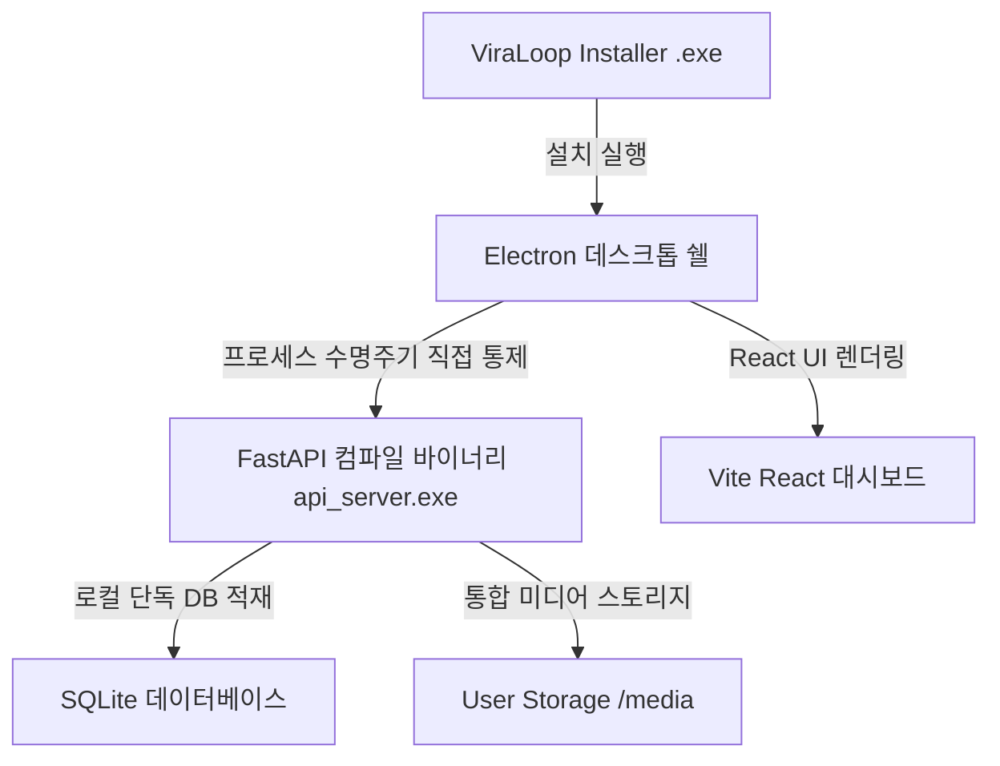

# 📦 07. Standalone Packaging & Bundle Blueprint (단독 실행 파일 패키징 및 빌드 아키텍처)

본 문서는 **ViraLoop Studio**의 최종 프로덕션 릴리즈를 위해, 복잡한 파이썬 가상환경(`venv`) 및 라이브러리 의존성과 하드코딩된 배치 스크립트를 제거하고 **원클릭 단독 실행 파일(Zero-Dependency Installer)**을 완벽히 패키징하기 위한 종합 아키텍처 가이드라인이자 명세서입니다.

---

## 1. Standalone 아키텍처 개요

기존의 파편화된 다중 가상환경 구조와 시스템 의존성(PostgreSQL, Redis, Celery)을 제거하고, 온전히 로컬 단독 실행이 가능한 형태로 서비스 컴포넌트를 정적 빌드합니다.



무설치 실행 환경을 달성하기 위해, 전체 모노레포는 아래의 빌드 레이어로 엄격히 분리되어 패키징됩니다:

| 빌드 영역 (Build Layer) | 산출물 유형 (Output Type) | 빌드 경로 (Location) | 패키징 도구 (Packaging Tool) |
|---|---|---|---|
| **Frontend UI** | 정적 HTML5/JS 자산 | `dist/` | Vite |
| **FastAPI Backend** | 단일 통합 실행 바이너리 | `dist-backend/` | PyInstaller |
| **Electron Shell** | Windows 설치형 패키지 | `release/` | Electron Builder |

---

## 2. Python 백엔드 단일 파일 컴파일 설계 (PyInstaller)

파이썬 소스 코드와 수십 기가바이트의 `venv` 폴더(10,000개 이상의 미세 파일)를 포함하여 패키징하면 설치형 파일 복사가 극도로 지연됩니다. 이를 극복하고자 전체 의존성을 1개의 `api_server.exe` 바이너리로 압축합니다.

### 🛠️ 빌드 자동화 스크립트 (`apps/api/build_backend.py`)
이 스크립트는 PyInstaller 컴파일 및 정적 리소스 복사를 원클릭으로 가동합니다.

```python
import os
import subprocess
import sys

def build():
    print("[Build] PyInstaller를 사용한 FastAPI 백엔드 컴파일 시작...")
    
    # 1. 경로 정의
    api_dir = os.path.dirname(os.path.abspath(__file__))
    entry_point = os.path.join(api_dir, "app", "main.py")
    output_dir = os.path.abspath(os.path.join(api_dir, "..", "..", "dist-backend"))
    
    os.makedirs(output_dir, exist_ok=True)
    
    # 2. PyInstaller 컴파일 플래그 정의
    cmd = [
        "pyinstaller",
        "--onefile",
        "--name=api_server",
        f"--distpath={output_dir}",
        "--clean",
        # FastAPI, Uvicorn, SQLAlchemy, SQLite용 동적 Import(Hidden Imports) 보장
        "--hidden-import=uvicorn.logging",
        "--hidden-import=uvicorn.loops",
        "--hidden-import=uvicorn.loops.auto",
        "--hidden-import=uvicorn.protocols",
        "--hidden-import=uvicorn.protocols.http",
        "--hidden-import=uvicorn.protocols.http.auto",
        "--hidden-import=uvicorn.protocols.websockets",
        "--hidden-import=uvicorn.protocols.websockets.auto",
        "--hidden-import=uvicorn.lifespan",
        "--hidden-import=uvicorn.lifespan.on",
        "--hidden-import=sqlalchemy.sql.default_comparator",
        "--hidden-import=sqlite3",
        "--hidden-import=pydantic_settings",
        "--hidden-import=jinja2",
        # 페르소나 데이터셋 파일 정적 내장 보장
        "--add-data=app/services/persona/persona_library.json;app/services/persona",
        entry_point
    ]
    
    # 가상환경 내 pyinstaller 탐색 및 우선권 부여
    pyinstaller_bin = os.path.join(api_dir, "..", "..", "venv", "Scripts", "pyinstaller.exe")
    if os.path.exists(pyinstaller_bin):
        cmd[0] = pyinstaller_bin
        
    subprocess.check_call(cmd, cwd=api_dir)
    print(f"✅ [Build] 백엔드 단일 바이너리가 dist-backend/api_server.exe 로 정상 빌드 완료되었습니다.")

if __name__ == "__main__":
    build()
```

---

## 3. Electron 메인 프로세스 동적 수명주기(Lifecycle) 개선

런타임에 Electron이 개발 모드(`dev`)인지 프로덕션 패키징 모드(`isPackaged`)인지 스스로 판별하여 백엔드 프로세스를 제어합니다.

### 🔄 동적 인프라 구동부 (`electron/main.js`)
```javascript
function startViraLoopInfrastructure() {
  const isPackaged = app.isPackaged
  const resourcesPath = process.resourcesPath
  const storageDir = app.getPath('userData')

  let executablePath = ''
  let spawnArgs = []
  let workingDir = ''

  if (isPackaged) {
    console.log('[Orchestration] 패키징 모드 감지: Standalone 백엔드 바이너리를 다이렉트 구동합니다.')
    executablePath = path.join(resourcesPath, 'api_server.exe')
    spawnArgs = []
    workingDir = resourcesPath

    if (!fsSync.existsSync(executablePath)) {
      console.error('[Orchestration] 리소스 경로에 api_server.exe가 존재하지 않습니다:', executablePath)
      return
    }
  } else {
    console.log('[Orchestration] 개발 모드 감지: 로컬 venv 내의 파이썬 인터프리터를 가동합니다.')
    const pythonExecutable = path.join(__dirname, '..', 'venv', 'Scripts', 'python.exe')
    const apiDir = path.join(__dirname, '..', 'apps', 'api')

    if (!fsSync.existsSync(pythonExecutable)) {
      console.warn('[Orchestration] 가상환경(venv)을 찾을 수 없습니다:', pythonExecutable)
      return
    }

    executablePath = pythonExecutable
    spawnArgs = ['-m', 'uvicorn', 'app.main:app', '--host', '0.0.0.0', '--port', '8000']
    workingDir = apiDir
  }

  // Windows 한글 완성형 콘솔(CP949) 이모지 출력 시 발생하는 UnicodeEncodeError 차단용 글로벌 인코딩 강제
  const env = {
    ...process.env,
    DATABASE_URL: `sqlite:///${path.join(storageDir, 'viraloop.db').replace(/\\/g, '/')}`,
    REDIS_URL: '',
    CELERY_BROKER_URL: '',
    PYTHONPATH: isPackaged ? workingDir : path.join(__dirname, '..', 'apps', 'api'),
    PYTHONIOENCODING: 'utf-8',
    VIRALOOP_STORAGE_DIR: storageDir,
    VIRALOOP_MEDIA_ROOT: path.join(storageDir, 'media').replace(/\\/g, '/')
  }

  infraProcess = spawn(executablePath, spawnArgs, {
    cwd: workingDir,
    env: env,
    detached: false,
    stdio: 'pipe'
  })
}
```

---

## 4. Electron Builder 번들 팩 파일(extraResources) 등록

`electron-builder` 설정 내에 컴파일된 바이너리가 빌드 시 자동으로 복사되도록 구성이 반영되었습니다:

### ⚙️ 최상단 `package.json` 번들링 선언 정보
```json
"build": {
  "extraResources": [
    {
      "from": "dist-backend/api_server.exe",
      "to": "api_server.exe"
    },
    ...
  ]
}
```

---

## 5. 결론 및 향후 유지보수 가이드

이로써 ViraLoop Studio는 로컬 가상환경 및 배치 파일의 하드코딩된 실행 방식에서 벗어나, 완벽하게 통제된 **원클릭 통합 배포 아키텍처**를 달성했습니다.
* **유지보수**: 백엔드 파이썬 코드 수정 후 `npm run dev` 실행 전 혹은 최종 패키징 전에 `venv/Scripts/python.exe apps/api/build_backend.py` 명령어를 가동하여 `api_server.exe`를 업데이트할 수 있습니다.
