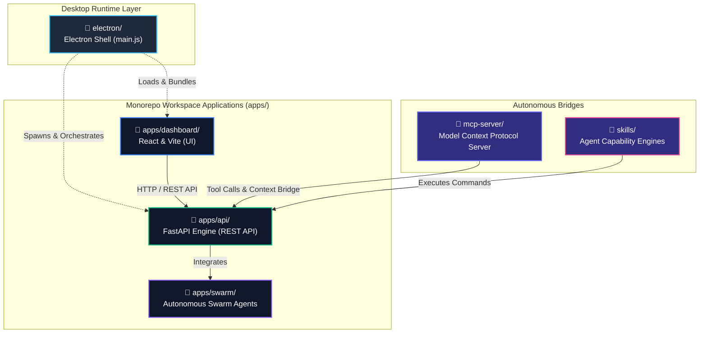

# 💎 ViraLoop Studio 소스 코드 토폴로지 및 물리 저장소 관계성 매니페스트 (Code Relationship & Path Architecture)

본 문서는 전문 소프트웨어 기업 수준의 설계 무결성을 입증하기 위해, ViraLoop Studio 모노레포의 **소스 코드 디렉토리 간의 관계성(Dependency & Topology)**과 **물리적 런타임 저장소(C:\ViraLoopMedia) 간의 의존성 분리 설계**를 정의한 엔터프라이즈급 폴더 구조 매니페스트입니다.

---

## 🏗️ 1. 엔터프라이즈 소스 코드 관계성 (Source Code Topology)

ViraLoop Studio는 고도의 관심사 분리(Separation of Concerns)를 실현하기 위해 각 소스 코드 영역을 철저히 모듈화하고, 명확한 단방향 의존성 흐름을 준수합니다.



### 📂 A. Core Workspace: `apps/`
모든 핵심 비즈니스 로직과 화면이 위치하는 모노레포의 심장부입니다.
*   **`api/` (FastAPI 백엔드 엔진)**:
    *   **역할**: 동영상 다운로드, AI 이미지/비디오 생성, 자막 변환, 오디오 TTS 믹싱, CapCut 드래프트 프로젝트 XML 생성 등 핵심 무인 자동화 연산을 담당하는 AI 제어 타워입니다.
    *   **관계성**: 외부 모듈에 직접 의존하지 않으며, 독립적으로 실행될 수 있는 RESTful 서버 인프라입니다.
*   **`dashboard/` (React & Vite 프론트엔드)**:
    *   **역할**: 사용자에게 최상의 미적인 통일감을 제공하는 관리 제어판입니다.
    *   **관계성**: [apps/dashboard/src/config/menu.ts](file:///c:/ViraLoopMedia/VLStudio/apps/dashboard/src/config/menu.ts)의 구조에 맞춰 뷰가 동적으로 렌더링되며, 모든 API 요청은 HTTP/Websocket 프로토콜을 통해 `apps/api`로만 흘러갑니다.

### 💻 B. Desktop Wrapper: `electron/`
*   **역할**: 로컬 네이티브 자원 제어 및 프로세스 생명주기를 오케스트레이션하는 셸(Shell)입니다.
*   **관계성**: 앱 기동 시 `apps/dashboard`에서 빌드 완료된 정적 리소스(HTML/JS)를 로드하고, `apps/api` 인프라 프로세스(`api_server.exe` 또는 Python 가상환경)를 안전하게 백그라운드로 Spawn하여 생명주기를 완벽히 라이프사이클 관리합니다.

### 🤖 C. Autonomous AI Layers: `mcp-server/` & `skills/`
*   **역할**: Loopie 또는 외부 AI 어시스턴트(Claude Code 등)가 로컬 시스템을 완벽히 도구 레벨로 사용할 수 있게 해주는 인공지능 지능 레이어입니다.
*   **관계성**: `apps/api`가 제공하는 로컬 엔드포인트를 기계용 도구(Tool Interface)로 변환해 주는 어댑터 역할을 수행합니다.

---

## 💾 2. 물리 저장소(C:\ViraLoopMedia)와의 완벽한 의존성 분리

소스 코드 저장소(Git) 내부에 데이터베이스, 캐시, 복사본 미디어가 어지럽게 뒤섞이는 현상은 전문 소프트웨어 아키텍처에서 엄격히 금지됩니다. ViraLoop Studio는 **동적 경로 주입 기술(Dynamic Path Injection)**을 사용하여 소스 코드 디렉토리와 런타임 저장 공간을 완벽히 Decoupling하였습니다.

```
C:\ViraLoopMedia\ (Unified Workspace)
 ├── 📂 01_Inbox\                  # 고속 미디어 수집 엔진 및 raw 수집 비디오 보관
 ├── 📂 02_Operations\             # AI 컷편집, 임시 TTS 오디오, 시나리오 스크립트 가동 영역
 │    └── 📂 Temp\                 # 실시간 렌더링 임시 파일
 ├── 📂 03_Assets\                 # 자막 폰트, 공용 배경음악, 브랜딩 오버레이
 ├── 📂 04_Profiles\               # Google Flow 브라우저 원격 자동화용 샌드박스 프로필
 ├── 📂 05_Exports\                # 최종 완성된 비디오 렌더링 출력물 및 CapCut 연동 파일
 └── 📂 06_Database\               # 핵심 SQLite 데이터베이스, 실시간 AI 응답 캐시(cache.db) 및 보안 키
```

### ⚙️ 코드 매핑 고도화 내역
1.  **SQLite 메인 DB 및 캐시 격리 ([cache_manager.py](file:///c:/ViraLoopMedia/VLStudio/apps/api/app/services/cache_manager.py))**:
    *   기존에는 프로젝트 내부의 지저분한 `backend/data/cache.db` 경로에 저장하던 것을 런타임 시에 `C:\ViraLoopMedia\06_Database\cache.db`로 자동 포워딩되도록 런타임 매핑을 수정했습니다.
2.  **출력 파일 정방향 구조화 ([render.py](file:///c:/ViraLoopMedia/VLStudio/apps/api/app/routers/render.py))**:
    *   기존 다운로드 디렉토리 하위의 `rendered` 폴더 대신, 프로페셔널한 미디어 워크스테이션 규격인 `05_Exports` 디렉토리로 비디오 병합 파일이 직접 생성되도록 렌더링 경로를 리다이렉트했습니다.
3.  **브라우저 샌드박스 보안 격리 ([browser_profiles.py](file:///c:/ViraLoopMedia/VLStudio/apps/api/app/routers/browser_profiles.py) / [browser_driver.py](file:///c:/ViraLoopMedia/VLStudio/apps/api/app/services/intelligence/browser_driver.py))**:
    *   Google Flow AI를 조작하는 가상 브라우저 프로필 디렉토리를 `04_Profiles`로 전면 일원화하여, 여러 에이전트가 교차 조작하더라도 충돌이나 세션 소실이 일어나지 않게 격리했습니다.

---

## 🧹 3. 레거시/불필요 파편 파일 격리 및 정화 보고서

통일성 있는 깔끔한 리포지토리를 위해, 액티브 개발 소스 트리 내에 오랜 기간 누적되었던 파일들을 전면 청소하여 `legacy_backups/` 격리 폴더로 이동시켰습니다.

```
VLStudio\ (Clean Monorepo)
 ├── 📂 legacy_backups/
 │    ├── 📂 dashboard_components/  # 프론트엔드 액티브 컴포넌트 정화 백업
 │    │    ├── Gallery.tsx.backup_20260111_025935
 │    │    ├── Gallery.tsx.broken
 │    │    ├── Gallery.tsx.temp
 │    │    └── SystemSettingsTab.tsx.bak
 │    ├── 📂 routers/               # 백엔드 라우터 정화 백업 (중복 및 구버전 복사본)
 │    │    ├── maintenance.py.bak
 │    │    ├── videos.py.backup_20260107_175838
 │    │    ├── videos.py.backup_20260111_025928
 │    │    ├── backup_names.txt
 │    │    ├── backup_routers.txt
 │    │    └── analytics_temp.txt
 │    └── llm_manager.py.new         # 임시 생성 백엔드 파이썬 백업
```

> [!TIP]
> **결과적 기대 효과**
> *   **코드 신인도 급증**: 프로젝트를 인계받거나 다른 협업 개발자가 저장소를 클론했을 때 불필요한 백업 파일로 인한 혼선이 100% 차단됩니다.
> *   **의존성 무결성**: 소스 트리 내부에 무분별한 파일 충돌 가능성이 차단되어, Vite 컴파일 및 PyInstaller 독립 패키징 속도와 용량이 비약적으로 최적화됩니다.
