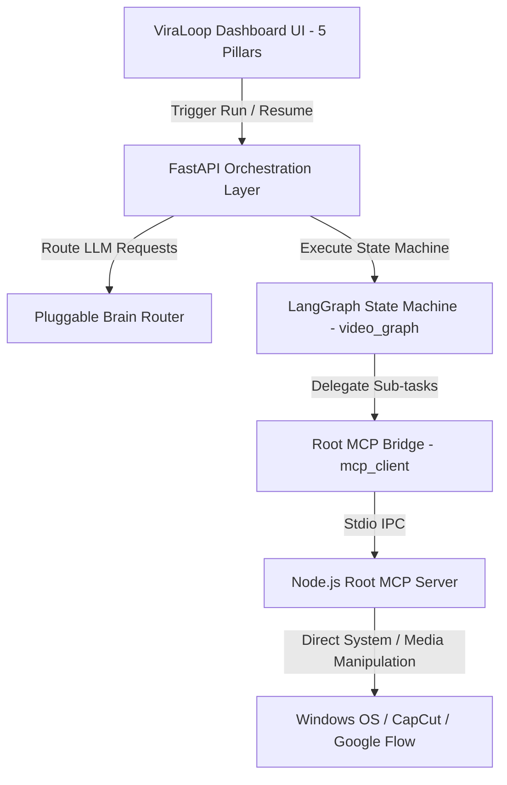

# 09. Agentic OS & Pluggable Brain Integration

ViraLoop Studio has transitioned from a monolithic legacy macro executor to a highly sophisticated **Agentic OS** utilizing modular LangGraph backend routing, pluggable LLM configurations, and direct Root MCP control.

---

## 1. Architectural Architecture Overview

---

## 2. Pluggable Brain Router (`brain_router.py`)
Provides runtime swapping of the underlying LLM "brains" (e.g., Anthropic Claude, OpenAI GPT-4o, Local Hermes-v3) without requiring application restarts.
*   **Fail-Safe Engine**: Automatically falls back to the next best available provider if credentials or network fails.
*   **Dynamic Binding**: Translates generic user prompts using the HSL tuned capabilities of the active model.

## 3. LangGraph State Machine (`video_graph.py`)
Replaces linear script executions with an iterative, state-aware Directed Acyclic Graph (DAG).
*   **Type A vs. Type B Branching**:
    *   **Type A (Curation/Remix)**: Downloads popular competitor videos, performs script edits, and overlays standard template assets.
    *   **Type B (Generative)**: Generates highly engaging scripts, feeds them to AI generators (Google Flow / Veo), and synthesizes fully customized media.
*   **HITL (Human-in-the-Loop) Interruption**: Utilizes LangGraph's native thread checkpointing. The system suspends execution at the rendering stage, prompts the human via the dashboard, and awaits approval before continuing.

## 4. Root MCP Bridge (`mcp_client.py` & `mcp_registry.py`)
Exposes Node.js server capabilities directly to the Python FastAPI process using stdio streams.
*   **Unified Command Hub**: Instead of duplicating tools across systems, the python backend queries the Node.js server to list and execute 40+ granular media and file-editing operations.
*   **Secure Execution Shield**: All file interactions, downloads, and rendering instructions are constrained within the user's workspace profile boundaries.

## 5. UI Integration
*   **5-Pillar Dashboard**: Segmented into *통합 관제소 (C2 Dashboard)*, *스마트 스카우터 (Smart Scouter)*, *전략 연구소 (Strategy Lab)*, *자동화 작업 대기열 (Work Queue)*, and *커맨더 콘솔 (Commander Console)*.
*   **HITL Warning Banner**: Added a premium-styled orange pulsing alert in the Work Queue indicating when an agent is awaiting human approval to proceed with rendering.
*   **Terminal Interface**: Commander Console dynamically fetches and renders available MCP tools to prove connection integrity.
